# Essentiel Spring Boot

Avec Kahina Ioualitene, partez à la découverte du framework Spring et de son module Spring Boot, pour le développement d'applications Java. À l'aide d'exemples pratiques, vous verrez comment injecter des dépendances puis vous lancer dans une application Spring. Vous aborderez le principe d'autoconfiguration et vous apprendrez à utiliser les starters et différents types de contrôleurs. Vous testerez et vous superviserez vos applications avec JUnit et Spring Boot Actuator, avant d'exécuter des beans au démarrage. À la fin de cette formation, vous aurez acquis toutes les bases pour mettre en œuvre Spring Boot.

## Le Noyau de Spring
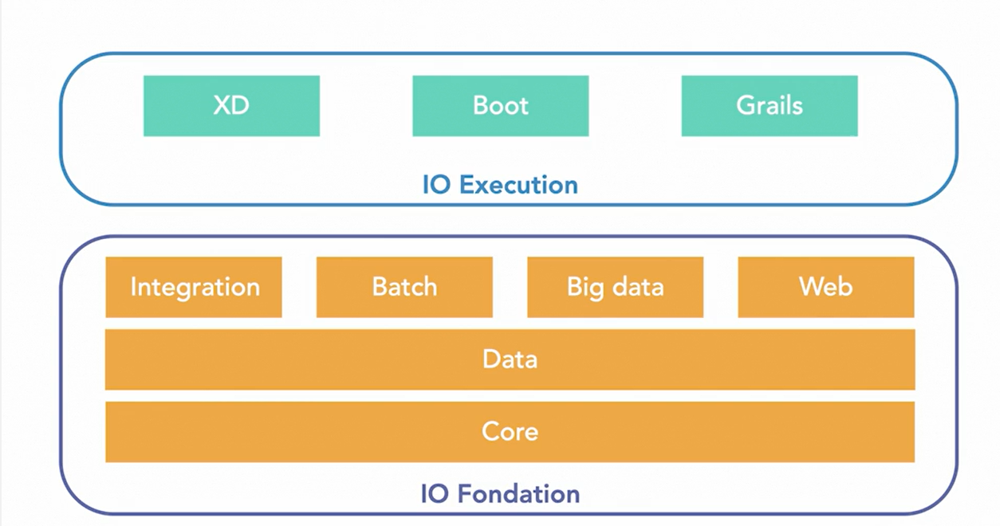

## Définition de Spring Boot
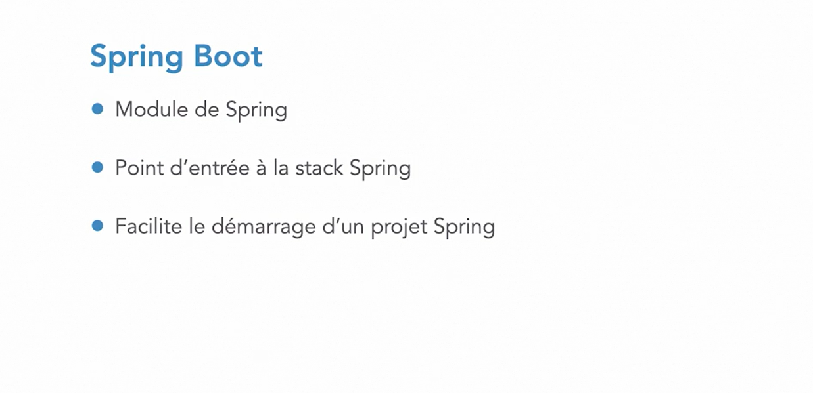

## Les Avantages d'utiliser Spring Boot
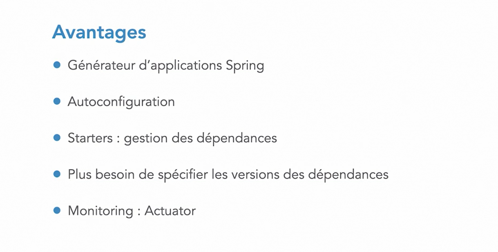

## Les Inversion de Contrôle en Spring Boot
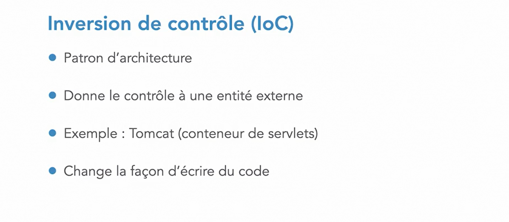

## Les Avantages de l'Inversion de Contrôle
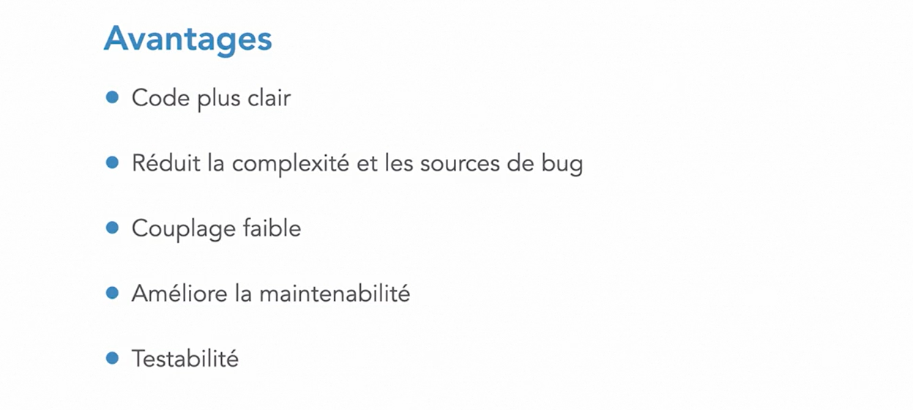

## L'Inversion de Contrôle en Spring Boot avec les Beans
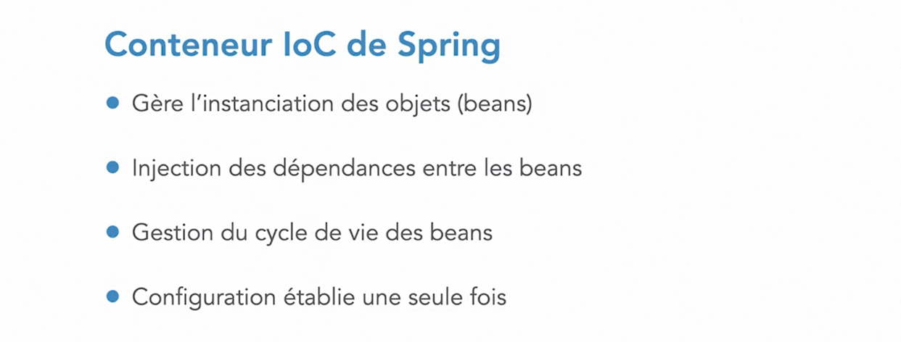

## Le conteneur IOC de Spring Boot (ApplicationContext)
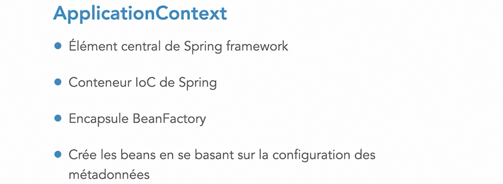

## Le Fonctionnement du Conteneur IOC de Spring Boot
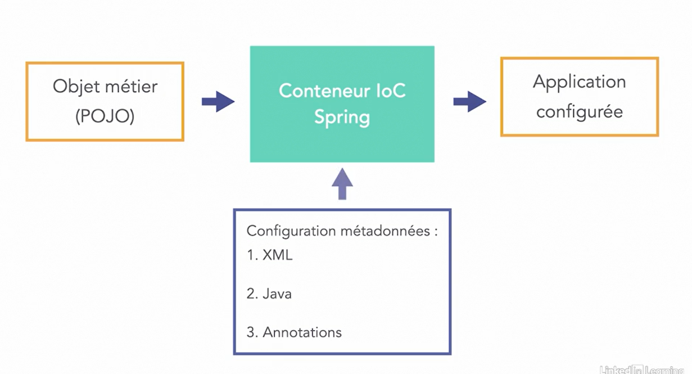

## La Configuration des Métadonnées en Spring Boot
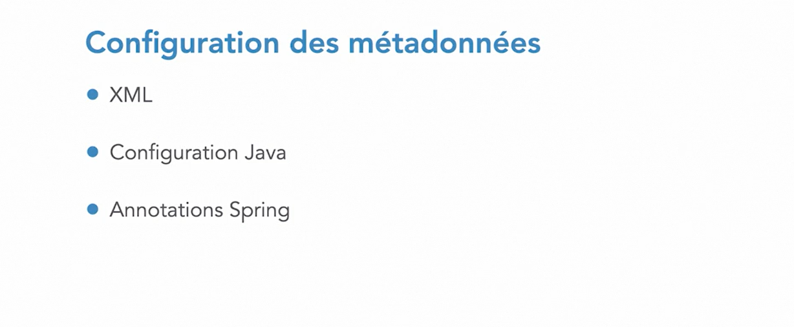

## La Configuration avec les Classe Java
Pour cela, nous utilisons le plus souvent les annotations suivantes:
1. <code>@Configuration</code>: cette annotion indique à **Spring boot** qu'il s'agit d'une classe de configuration.
2. <code>@Bean</code>: celle ci indique precède une méthode qui crée des objets Java
3. <code>@Autowired</code> elle permet de faire les **Injection de dependance** en 
   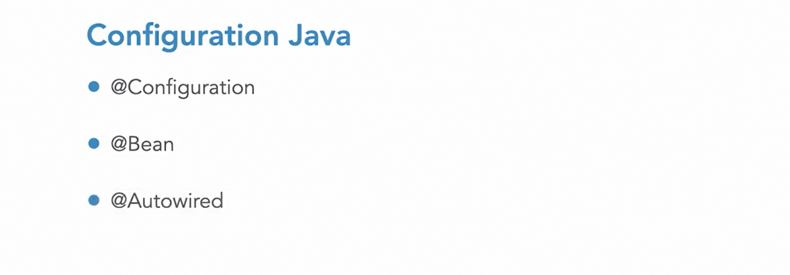

## La Configuration avec les Annotation Spring Boot
1. <code>@Component</code>: elle marque une classe java en tant que Bean pour les mecanismes d'analyse spring puis l'ajouter au context de l'application. elle a plusieurs dérivées: **@Repository**, **@Service**, **@Controller**
2. <code>@Repository</code>: qui est utilisée sur les classes(Interfaces) java qui manipulent ou accèdent directement aux bases de données.
3. <code>@Service</code>: elle marque une classe java qui effectue des traitements métiers.
4. <code>@Controller</code>: est utilisée pour indiquer que la classe est un controller **Spring Boot**
5. <code>@ComponentScan</code>: qui est utilisée pour indiquer à **Spring Boot** les **packages java** qu'il faut utilisés pour trouver les composants **Spring**
   
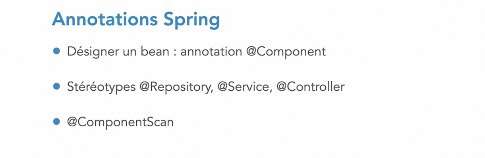

## Comment créer une Application Spring Boot
La  façon la plus simple est d'utilisée le site [Spring Initializr](https://start.spring.io) 
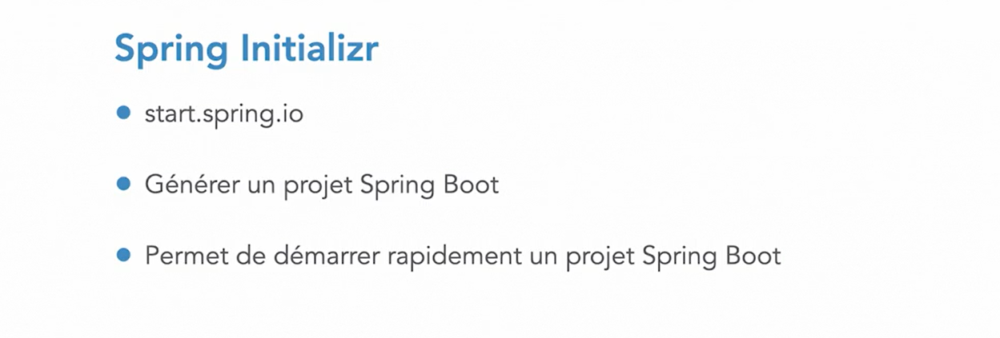

## Comment Proceder avec Spring Initializr
Le formulaire de spring initializr nous permet choisir:
* le type de projet: **Maven**, **Gradle**
* le language à utiliser: **Java**, **Kotlin**, **Groovy**
* la version de spring boot à utiliser
* le nom du package qu'on veut utiliser: (group)
* le nom du projet: (artifact)
* le packaging: **jar** ou **war**
* les dependances qu'on souhaite ajouter à notre 
Lorqu'on clique sur le bouton **générate** il va enrégistrer le projet dans  notre PC sous format zip 
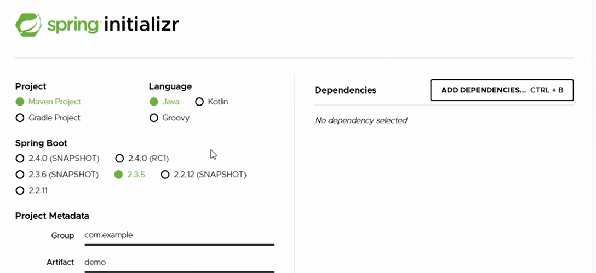

## Comment Proceder Avec Les IDE
1. on peut utiliser IDE STS
2. on peut aussi utiliser IDE Eclise avec le plugin STS
3. on peut utiliser IDE Intelij ....
   et  la  procedure est la même que celle qu'on a utilise precedemment avec **Spring Initializr**, quelques captures d'écran pourraient illustrer mon propos

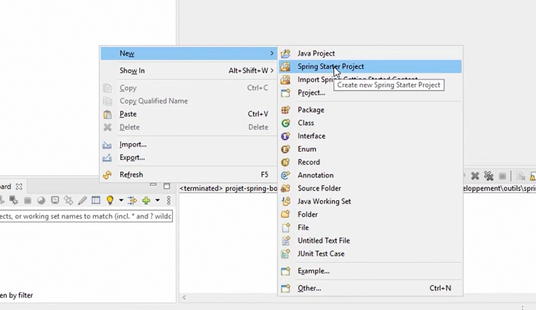
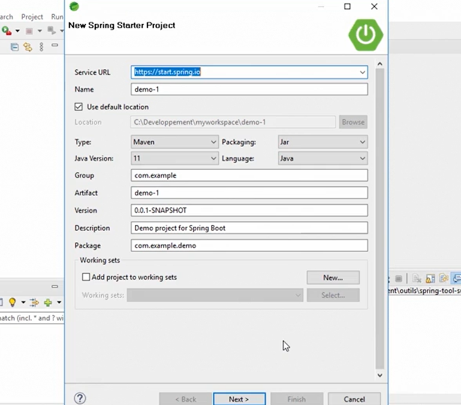
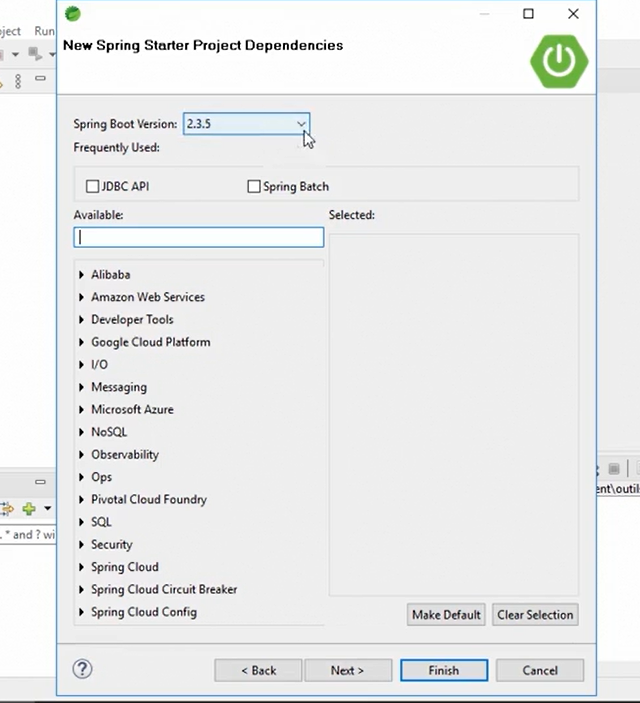

## Une Dependance Starter Spring Boot
**Une Dependance Starter Spring** est une qui est une dependance qui lui même contenant plusieurs dependances **retrocompatibles**.
L'un des points forts de Spring Boot est qu'il trouve lui même les dependances compatibles entre elles.

## Quelques Fichiers de Configurations 
1. l'un des fichiers imports est **pom.xml** qui permet de:
   * lister toutes les dependances d'une application **Spring Boot**
   * ajouter d'autres dependances à notre application
   * modifier le nom, la description
   * configurer le build, les propriétés
   * ...
2. nous avons aussi le fichier **application.properties** qu'on peut modifier son extension en **yaml** si nous le souhaitons bien, ce fichier permet également de faire des configuration aussi telles que:
   * changement de port
   * configuration de base de données
   * ...
  
## AutoConfiguration En Spring Boot
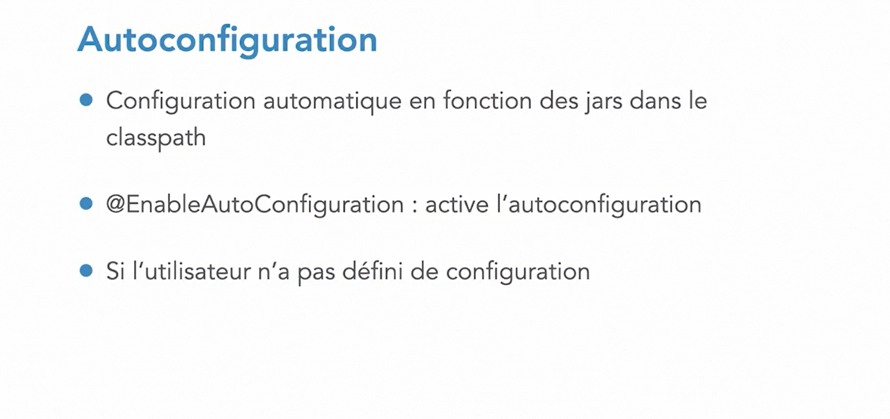
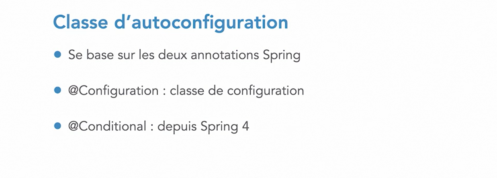

## Connaître Les AutoConfigurations en Spring Boot
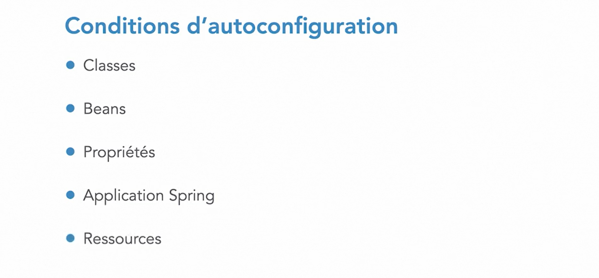
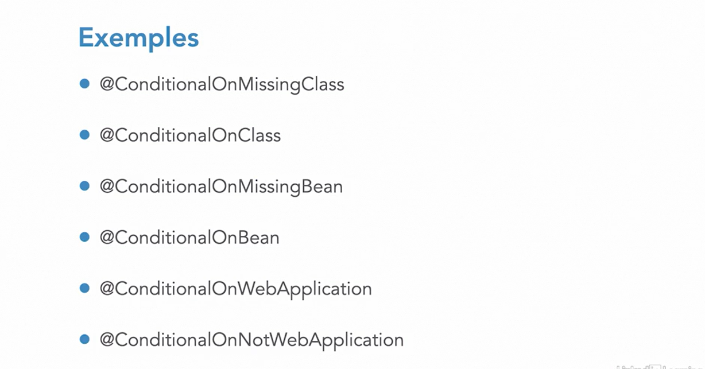

## Starter Spring Boot
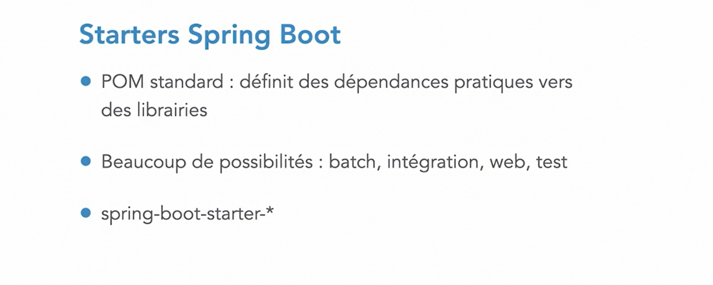

## Quelques Starter Spring Boot

## Le Modele MVC En Spring Boot
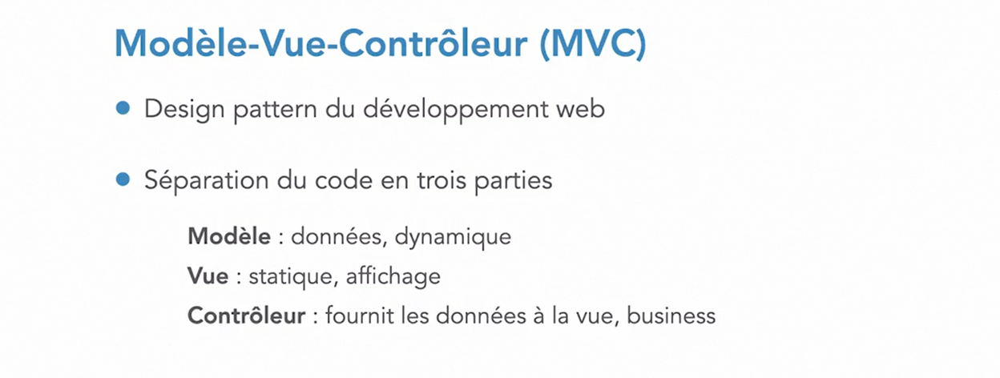

## Spring MVC
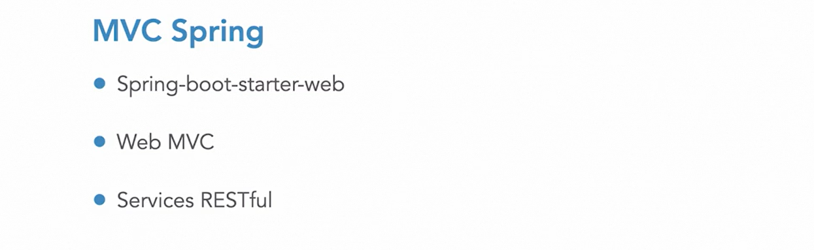

## Contôller en Spring Boot
