# Essentiel Spring Boot

## Auteur: CAMARA Laby Damaro
sources: 
 1. [https://github.com/camara94/essentiel_spring_boot](https://github.com/camara94/essentiel_spring_boot)
 2. [linkedin Learning](https://www.linkedin.com/learning/l-essentiel-de-spring-boot/bienvenue-dans-l-essentiel-de-spring-boot)
 3. [Openclassrooms](https://openclassrooms.com/fr/courses/6900101-creez-une-application-java-avec-spring-boot)

Dans cours PDF,nous allons découvir ensemble le framework Spring et de son module Spring Boot, pour le développement d'applications Java. À l'aide d'exemples pratiques, nous verrons comment injecter des dépendances puis nous verrons comment lancer une application Spring. nous aborderons le principe d'autoconfiguration et nous apprendrons l'utilisation utilisation des **starters** et **différents types de contrôleurs**. Nous testerons et nous superviserons nos applications avec **JUnit et Spring Boot Actuator**, avant d'exécuter des beans au démarrage. À la fin de cette formation, nous aurons acquis toutes les bases pour mettre en œuvre Spring Boot.

## Le Noyau de Spring
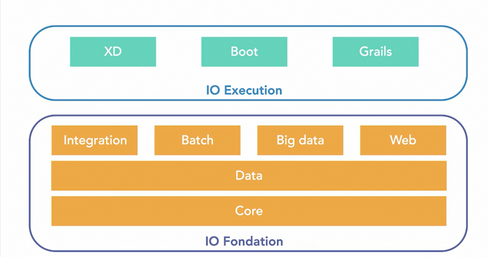

## Définition de Spring Boot
Spring Framework et Spring Boot ! Spring Framework et Spring Boot offrent un environnement de développement solide et efficace, qui va vous simplifier la vie. La gestion des dépendances, la configuration, la gestion des propriétés et le déploiement seront bientôt des jeux d'enfants !

## Les Avantages d'utiliser Spring Boot

## Les Inversion de Contrôle en Spring Boot
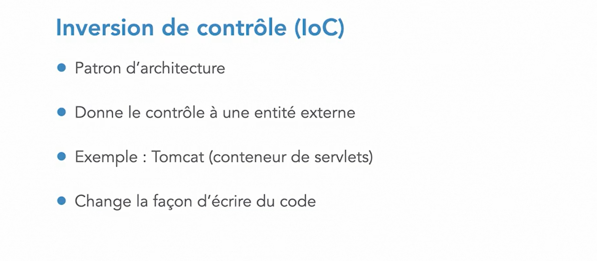

## Les Avantages de l'Inversion de Contrôle

## L'Inversion de Contrôle en Spring Boot avec les Beans

## Le conteneur IOC de Spring Boot (ApplicationContext)

## Le Fonctionnement du Conteneur IOC de Spring Boot
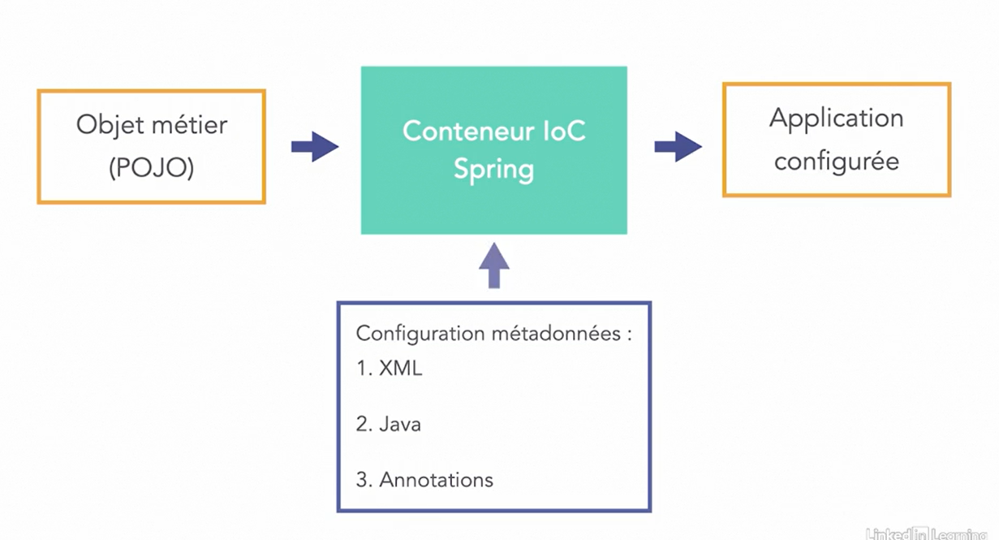

## Illustration De L'IOC en Spring
Ici nous allons créer quatre classe(A, B, C, Main) pour illustrer l'inversion de contrôl avec spring boot.
Avant de créer les classes, il faut ajouter cette dépendance la section **dependances** dans le fichier **pom.xml**
dans un projet **maven** si ce n'est pas directement un projet spring par defaut.

### Classe A

### Classe B

### Classe C

### Classe Main
L' **ApplicationContext** est l'interface centrale au sein d'une application Spring qui est utilisée pour fournir des informations de configuration à l'application. Il implémente l'interface BeanFactory. Par conséquent, ApplicationContext inclut toutes les fonctionnalités de BeanFactory.
C'est pourquoi ici, ici nous n'avons pas bésoin faire des instanciation avec le mot clés **new**, et **spring boot** s'en charge automatiquement grâce à **ApplicationContext** 

## La Configuration des Métadonnées en Spring Boot
En Spring Boot, on peut procéder la configuration de trois manières à savoir:

## La Configuration avec les Classe Java
Pour cela, nous utilisons le plus souvent les annotations suivantes:
1. <code>@Configuration</code>: cette annotion indique à **Spring boot** qu'il s'agit d'une classe de configuration.
2. <code>@Bean</code>: celle ci indique precède une méthode qui crée des objets Java
3. <code>@Autowired</code> elle permet de faire les **Injection de dependance** en 
   

## La Configuration avec les Annotation Spring Boot
1. <code>@Component</code>: elle marque une classe java en tant que Bean pour les mecanismes d'analyse spring puis l'ajouter au context de l'application. elle a plusieurs dérivées: **@Repository**, **@Service**, **@Controller**
2. <code>@Repository</code>: qui est utilisée sur les classes(Interfaces) java qui manipulent ou accèdent directement aux bases de données.
3. <code>@Service</code>: elle marque une classe java qui effectue des traitements métiers.
4. <code>@Controller</code>: est utilisée pour indiquer que la classe est un controller **Spring Boot**
5. <code>@ComponentScan</code>: qui est utilisée pour indiquer à **Spring Boot** les **packages java** qu'il faut utilisés pour trouver les composants **Spring**
   

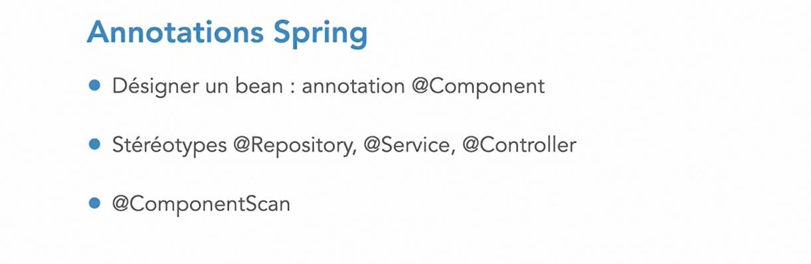

## Comment créer une Application Spring Boot
La  façon la plus simple est d'utilisée le site [Spring Initializr](https://start.spring.io)

## Comment Proceder avec Spring Initializr
Le formulaire de spring initializr nous permet choisir:
* le type de projet: **Maven**, **Gradle**
* le language à utiliser: **Java**, **Kotlin**, **Groovy**
* la version de spring boot à utiliser
* le nom du package qu'on veut utiliser: (group)
* le nom du projet: (artifact)
* le packaging: **jar** ou **war**
* les dependances qu'on souhaite ajouter à notre 
Lorqu'on clique sur le bouton **générate** il va enrégistrer le projet dans  notre PC sous format zip 

## Comment Proceder Avec Les IDE
1. on peut utiliser IDE STS
2. on peut aussi utiliser IDE Eclise avec le plugin STS
3. on peut utiliser IDE Intelij ....
   et  la  procedure est la même que celle qu'on a utilise precedemment avec **Spring Initializr**, quelques captures d'écran pourraient illustrer mon propos

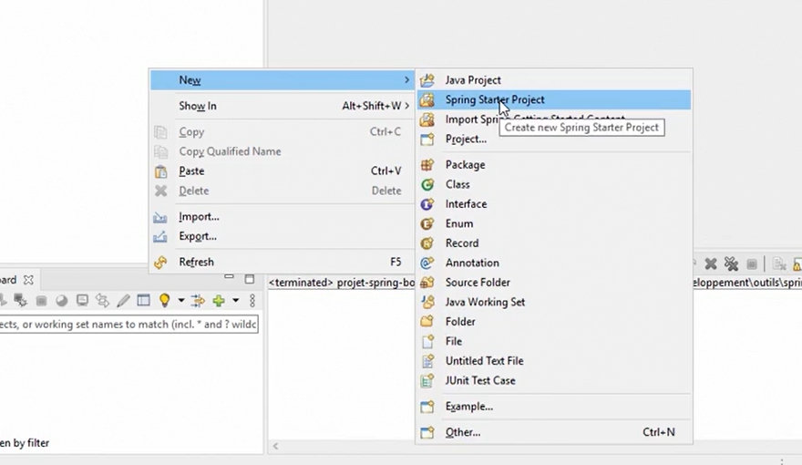
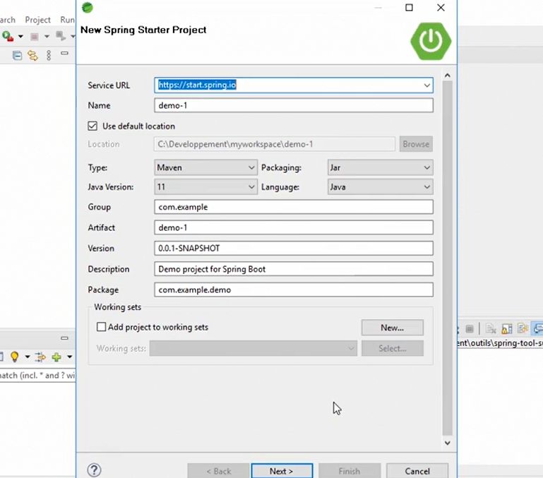
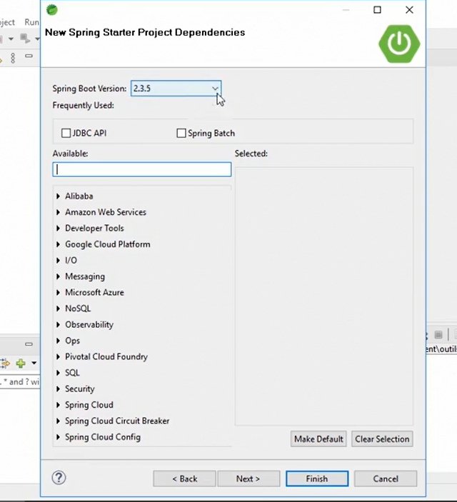

## Une Dependance Starter Spring Boot
**Une Dependance Starter Spring** est une qui est une dependance qui lui même contenant plusieurs dependances **retrocompatibles**.
L'un des points forts de Spring Boot est qu'il trouve lui même les dependances compatibles entre elles.

## Quelques Fichiers de Configurations 
1. l'un des fichiers imports est **pom.xml** qui permet de:
   * lister toutes les dependances d'une application **Spring Boot**
   * ajouter d'autres dependances à notre application
   * modifier le nom, la description
   * configurer le build, les propriétés
   * ...
    
2. nous avons aussi le fichier **application.properties** qu'on peut modifier son extension en **yaml** si nous le souhaitons bien, ce fichier permet également de faire des configuration aussi telles que:
   * changement de port
   * configuration de base de données
   * ...
    

## AutoConfiguration En Spring Boot
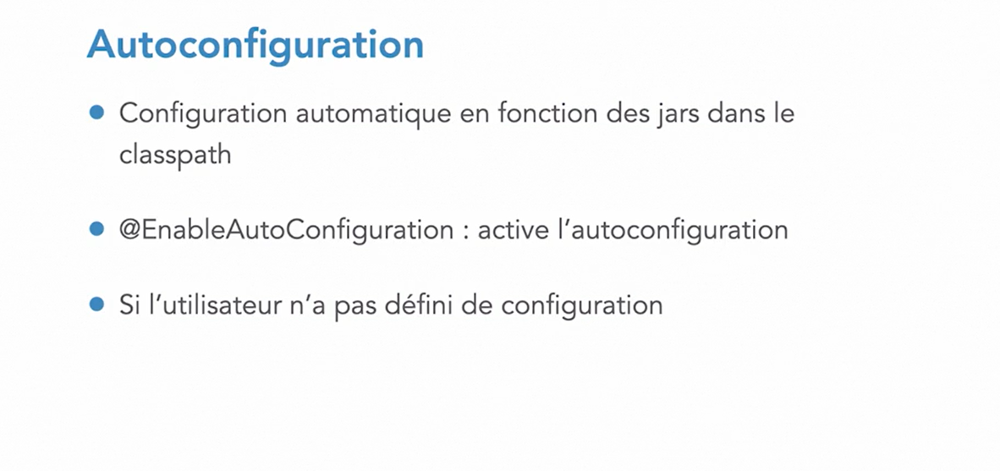
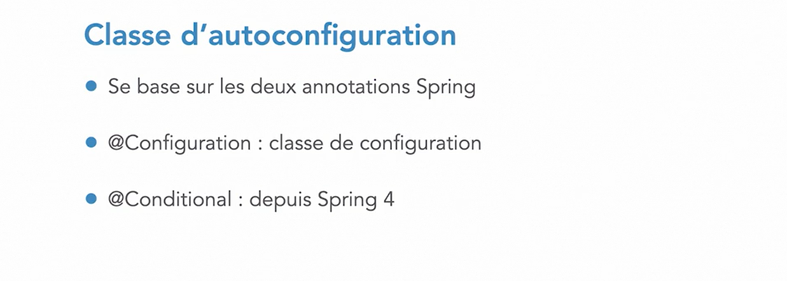
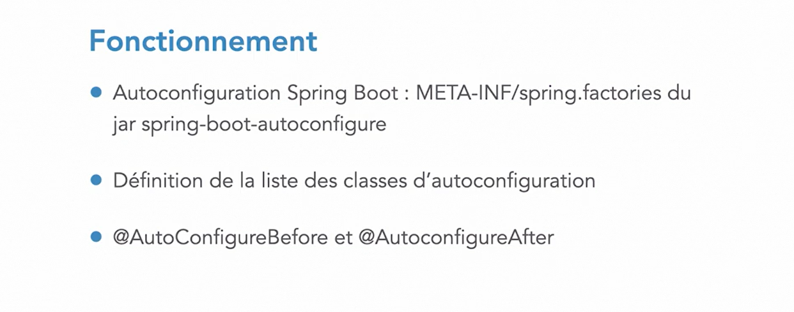

## Connaître Les AutoConfigurations en Spring Boot
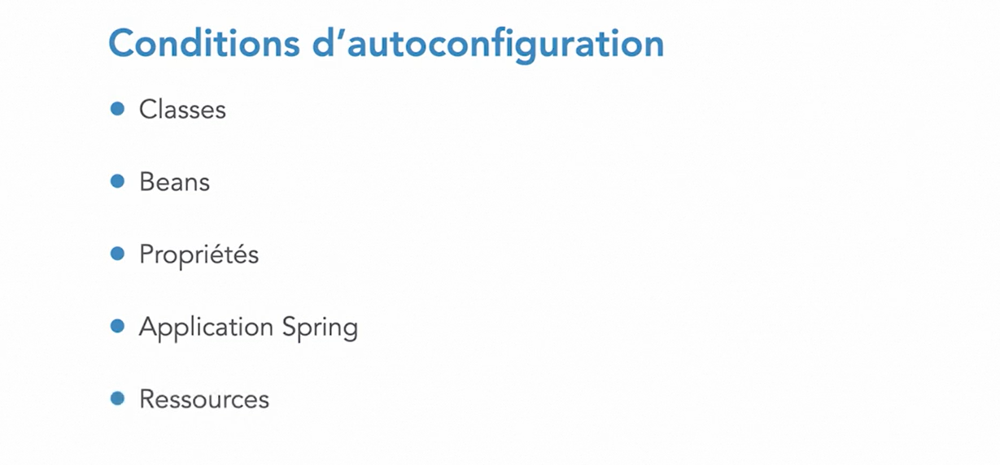
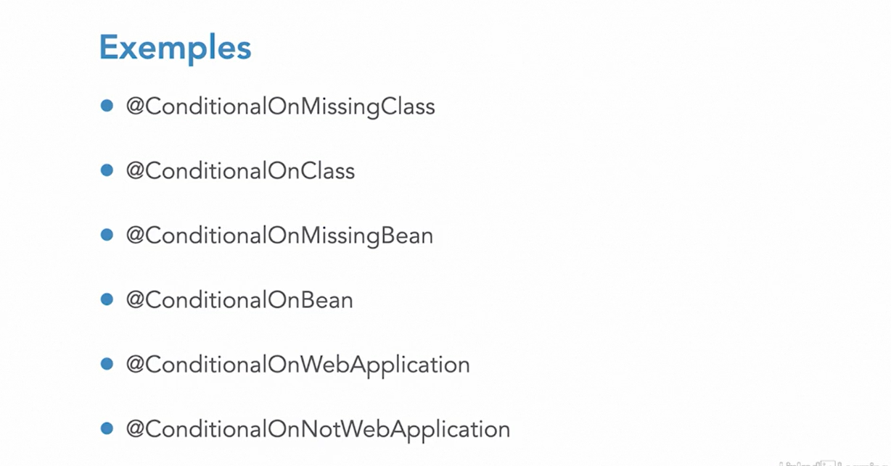

## Starter Spring Boot
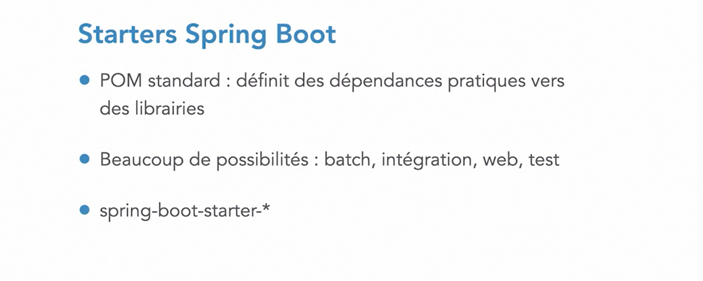

## Quelques Starter Spring Boot

## Le Modele MVC En Spring Boot
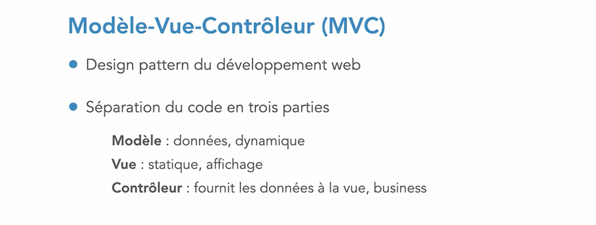

## Spring MVC

## Contôller en Spring Boot

## CommandLineRunner

## Conclusion
